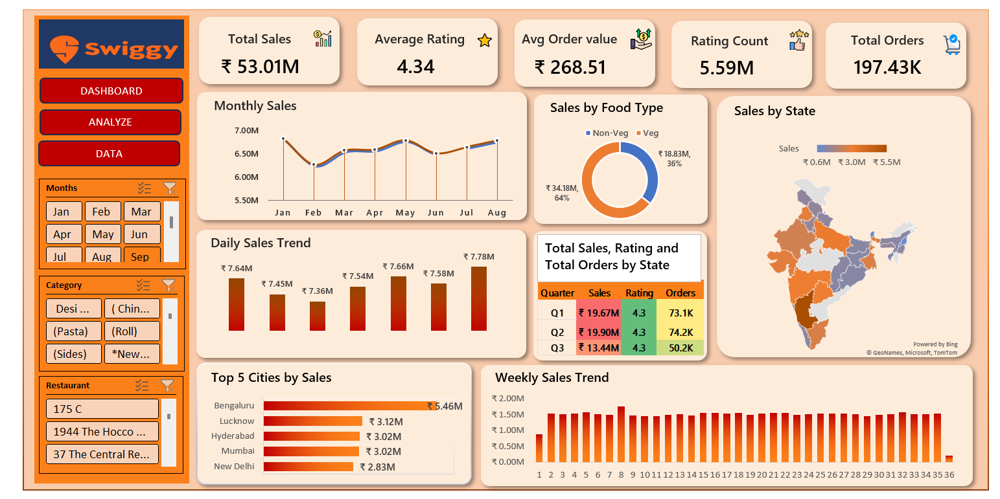

# 📊 Swiggy Sales Analysis 

## 📊 Dashboard Preview

## 🎯 Project Objective
The objective of this project is to analyze Swiggy’s food order data to understand sales performance, customer behavior, and rating trends using Excel Pivot Tables and an interactive dashboard.

---

## 🧩 Problem Statement
Swiggy requires insights into total sales, order volume, average order value, and customer ratings across time, food categories, cities, and states to support data-driven business decisions.

---

## 📌 Key KPIs Analyzed
- **Total Sales:** ₹53.01M  
- **Total Orders:** 197.43K  
- **Average Order Value:** ₹268.51  
- **Average Rating:** 4.34  
- **Ratings Count:** 5.59M  

---

## 📈 Dashboard Analysis
- Monthly, weekly, and daily sales trends to identify peak periods  
- Sales comparison by **Veg vs Non-Veg** food types  
- **State-wise sales distribution** using map visualization  
- Quarterly performance summary (Sales, Ratings, Orders)  
- Top 5 cities contributing the highest sales revenue  

---

## 🛠 Tools & Techniques Used
- Microsoft Excel  
- Pivot Tables & Pivot Charts  
- Slicers and Filters  
- Interactive Excel Dashboard  

---

## 📂 File Details
The Excel file contains **Raw Data, Pivot Tables, and Dashboard sheets** in a single workbook for end-to-end analysis.

---

